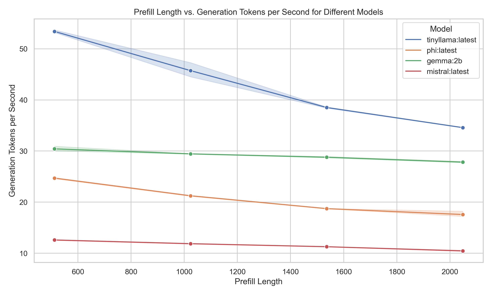
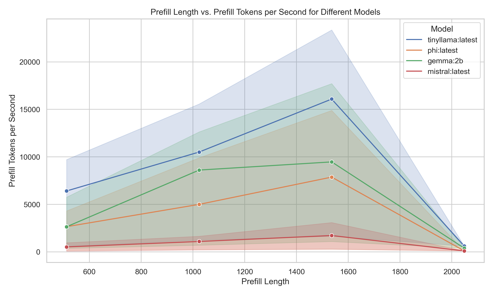
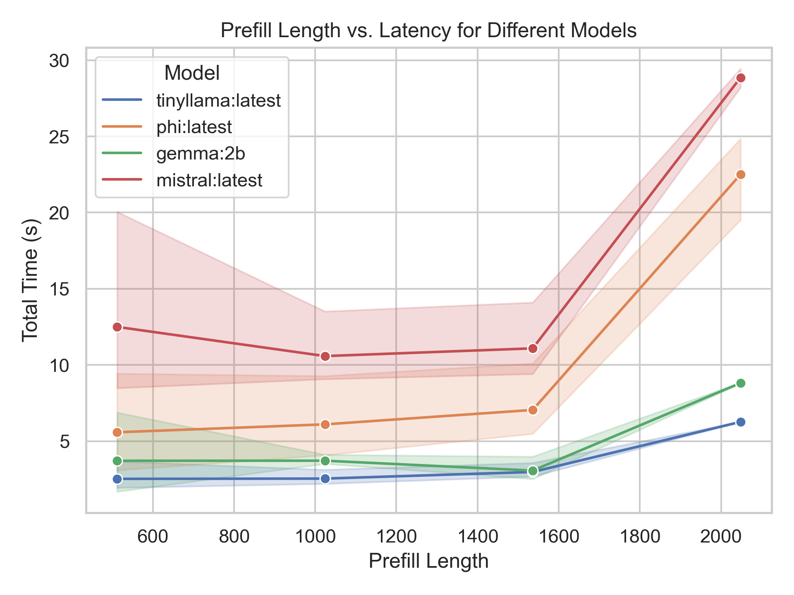
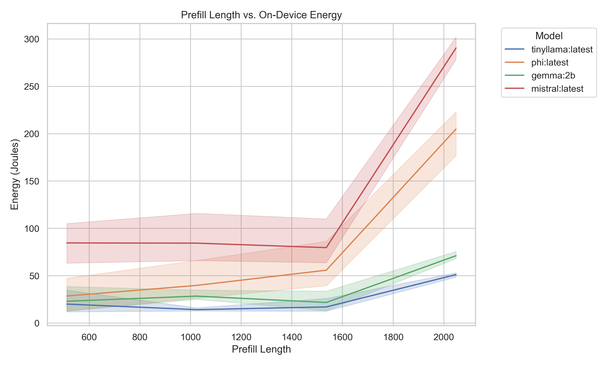
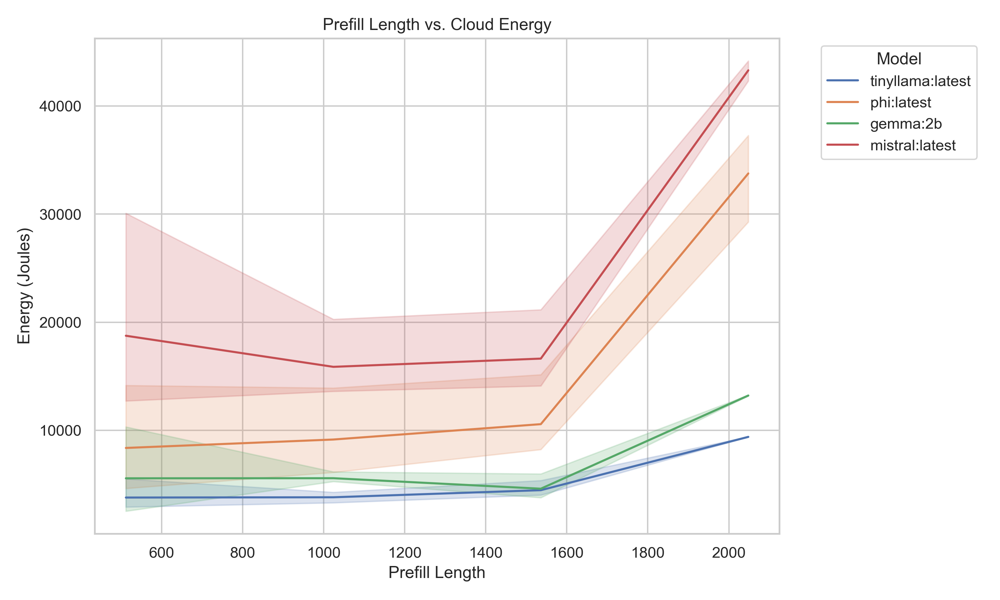
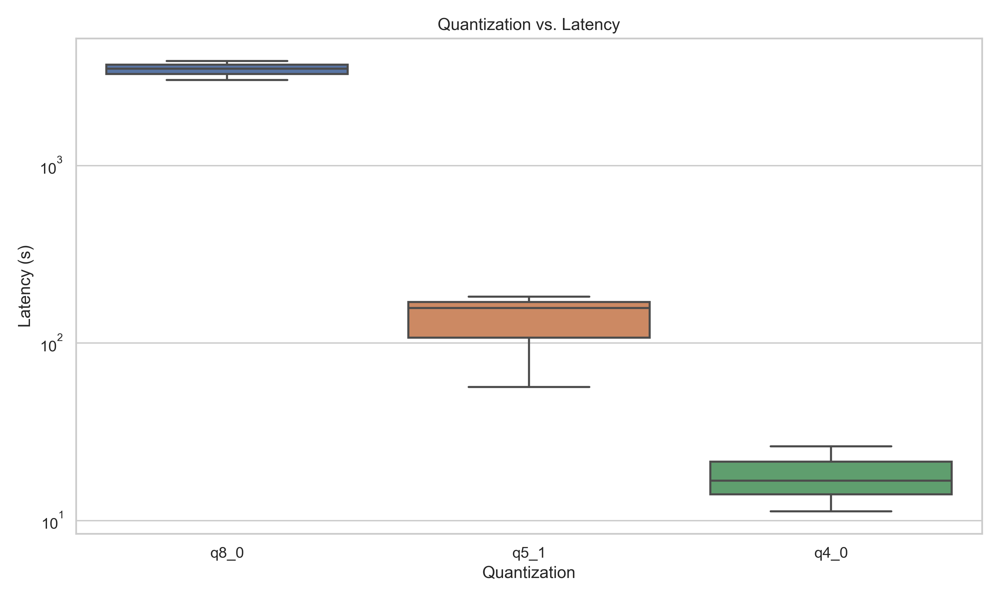
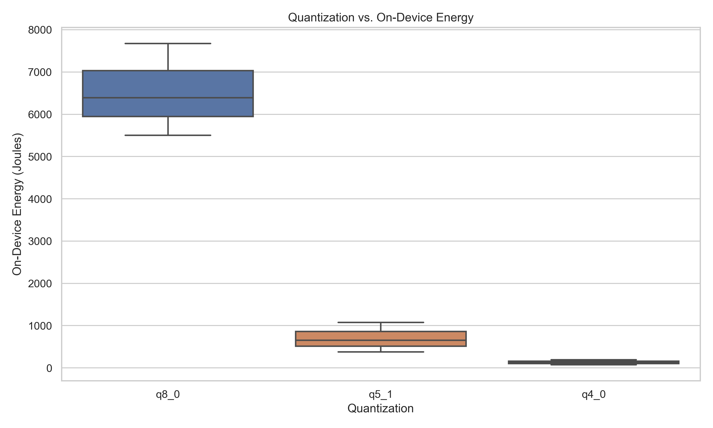
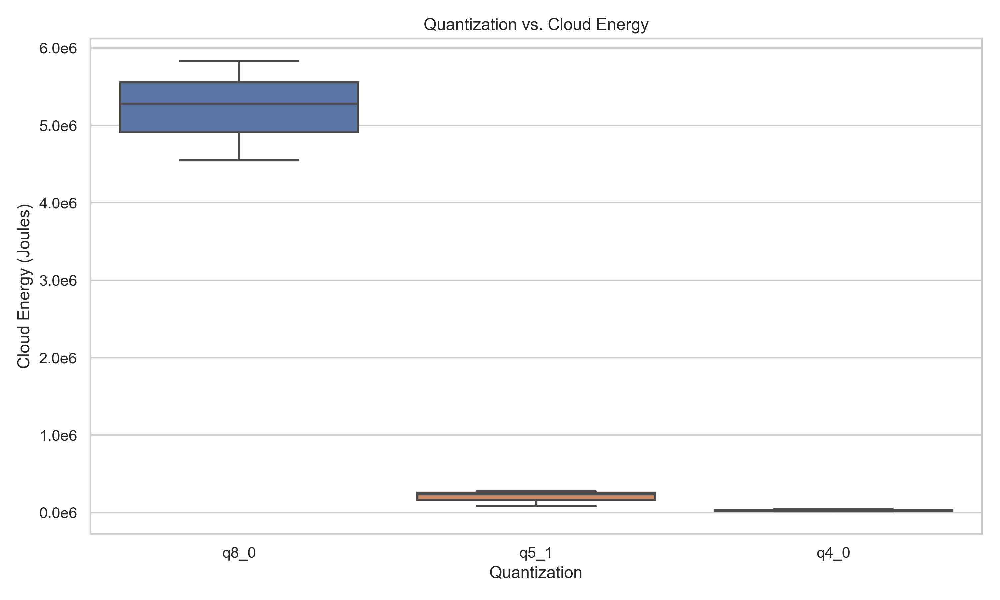

# On-Device LM Benchmarking with Ollama

This repository contains benchmark results analyzing the performance characteristics of language models (LLMs) running locally on Apple Silicon using **Ollama**, a lightweight framework for running LLMs locally.

## Understanding Model Performance Factors

Our benchmarks focus on three key factors that affect LLM performance:

1. **Prefill Length**: How input prompt size affects performance
2. **Quantization Levels**: How model precision affects efficiency and performance
3. **Model Architecture**: Comparing different models across workloads

Language model inference consists of two distinct phases:

1. **Prefill (Input Processing)**: The initial processing of the prompt/input tokens
2. **Decode (Generation)**: The sequential generation of each output token

These phases have fundamentally different performance characteristics. Ideally, this analysis would include optimization strategies for both, but sweeping across different decode-heavy lengths became difficult due to Ollama's level of abstraction. (Parameter tuning just doesn't cut it!)

## Key Findings

### Prefill Length Analysis

*Impact of prefill length on generation speed across models*

*Impact of prefill length on prefill processing speed across models*

*Total latency as prefill length increases across models*

**Key Observations:**

1. **Generation Speed Degradation**: As prefill length increases, all models show decreasing generation speeds. TinyLlama shows the steepest decline (from ~53 to ~34 tokens/s), while Mistral shows the most stable performance but at lower speeds (12-10 tokens/s).

2. **Prefill Throughput Curve**: Prefill tokens per second shows a distinctive pattern - increasing until ~1500 tokens, then dramatically dropping at 2000 tokens. This suggests cache/memory optimization boundaries.

3. **Latency Inflection Point**: All models show relatively stable latency until 1500 tokens, after which there's a sharp increase. This suggests a performance cliff when context length exceeds certain thresholds.

4. **Model Size vs Efficiency Trade-off**: Smaller models like TinyLlama process both prefill and generation tokens faster, but show more sensitivity to context length.

### Energy Consumption Analysis

*On-device energy consumption across prefill lengths and models*

*Estimated cloud energy consumption across prefill lengths and models*

**Key Thoughts:**

1. **Energy Consumption Pattern**: Both on-device and cloud energy follow a similar pattern - relatively stable until ~1500 tokens, then sharply increasing for 2000 tokens.

2. **Model Size Impact**: Larger models (Mistral, Phi) consume significantly more energy than smaller models (TinyLlama, Gemma), with the gap widening dramatically at longer prefill lengths.

3. **On-Device vs Cloud Energy**: Cloud energy estimates are consistently 50-100x higher than on-device measurements, highlighting the efficiency of Apple Silicon for inference.

4. **Critical Length Threshold**: The 1500-2000 token range appears to be a critical threshold for all models, suggesting memory/architecture constraints.

### Quantization Effects Analysis

*Impact of quantization level on inference latency*

*Impact of quantization on on-device energy consumption*

*Impact of quantization on estimated cloud energy consumption*

**Key Findings:**

1. **Dramatic Performance Differences**: Quantization has an enormous impact on performance. Moving from q4_0 (4-bit) to q8_0 (8-bit) increases latency by approximately 100x.

2. **Energy Efficiency Trade-offs**: 
   - q4_0 models use ~100-200J on-device vs. ~27,000J for q8_0
   - Cloud energy estimates show even more dramatic differences: ~40,000J for q4_0 vs. ~5,000,000J for q8_0

3. **Precision/Performance Trade-off**: Each step in quantization (q4→q5→q8) represents approximately an order of magnitude difference in both latency and energy consumption.

## Model Comparison

Our benchmarks compared four models running in Ollama:

- **TinyLlama**: Fastest overall performance, especially for generation
- **Gemma**: Good balance of speed and capability
- **Phi**: Moderate performance with good quality outputs
- **Mistral**: Slowest but potentially highest quality outputs

Each model shows different sensitivity to prefill length and different efficiency characteristics:

1. **TinyLlama**: 
   - Highest tokens per second for both prefill and generation
   - Most sensitive to increasing prefill length
   - Lowest energy consumption across all conditions

2. **Gemma**:
   - Consistent middling performance
   - Moderate energy consumption
   - Good balance for general use cases

3. **Phi & Mistral**:
   - Lower tokens per second across all conditions
   - Less sensitive to prefill length changes until the 1500 token threshold
   - Significantly higher energy consumption, especially at longer prefill lengths

## Practical Implications

These benchmarks reveal critical insights for deploying LLMs on edge devices:

1. **Context Length Optimization**: 
   - Keep prefill lengths under 1500 tokens when possible
   - Expect significant performance degradation beyond this threshold
   - Consider context window pruning techniques for longer documents

2. **Quantization Strategy**: 
   - 4-bit quantization (q4_0) offers dramatically better performance and energy efficiency
   - Each bit of precision comes with substantial performance costs
   - Consider model quality requirements carefully when selecting quantization levels

3. **Model Selection Guidelines**:
   - TinyLlama offers the best performance but is most sensitive to context length
   - Gemma provides balanced performance with moderate energy usage
   - Mistral and Phi provide highest quality but at significant performance and energy costs

4. **Energy Considerations**:
   - Running LLMs on-device is significantly more energy-efficient than cloud alternatives
   - Energy consumption increases non-linearly with model size and context length
   - Optimization strategies that target the 1500-token threshold can yield substantial energy savings
