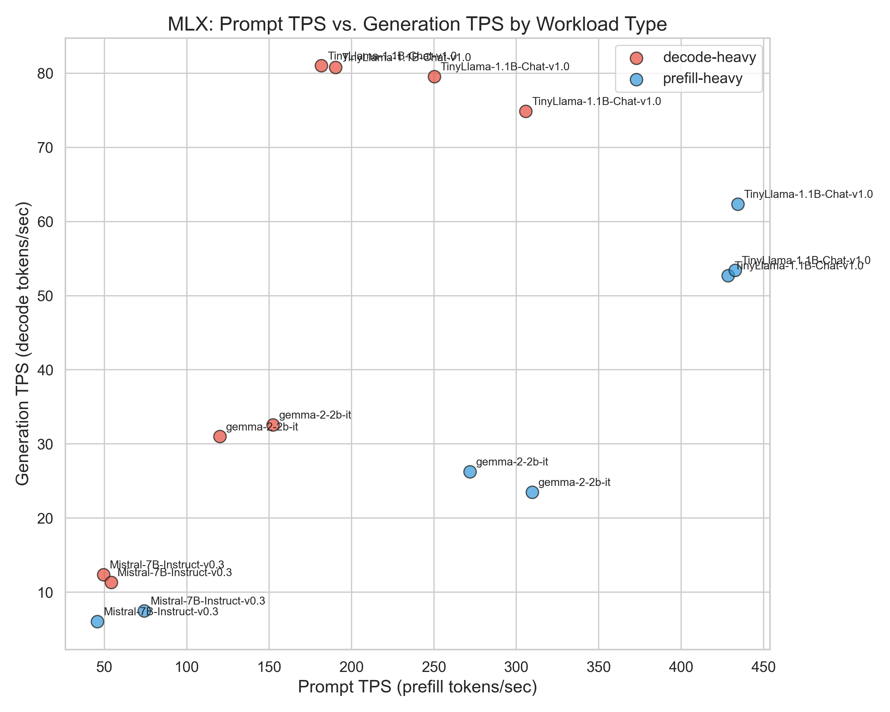
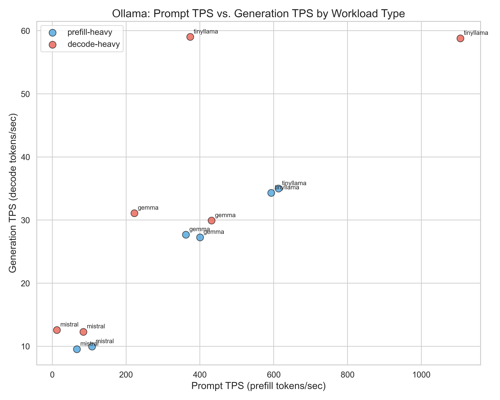
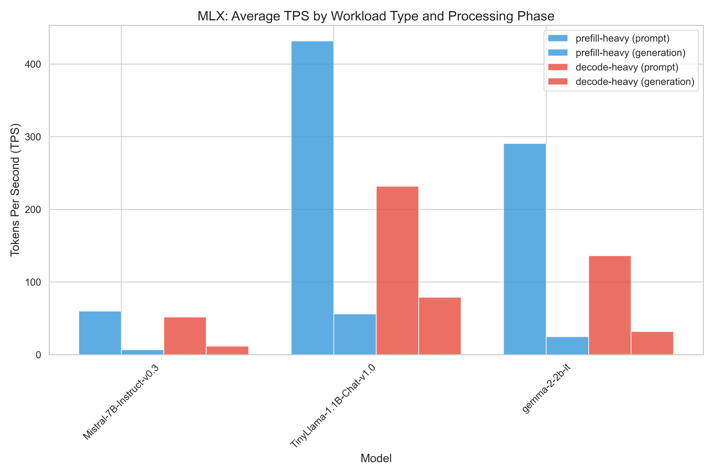
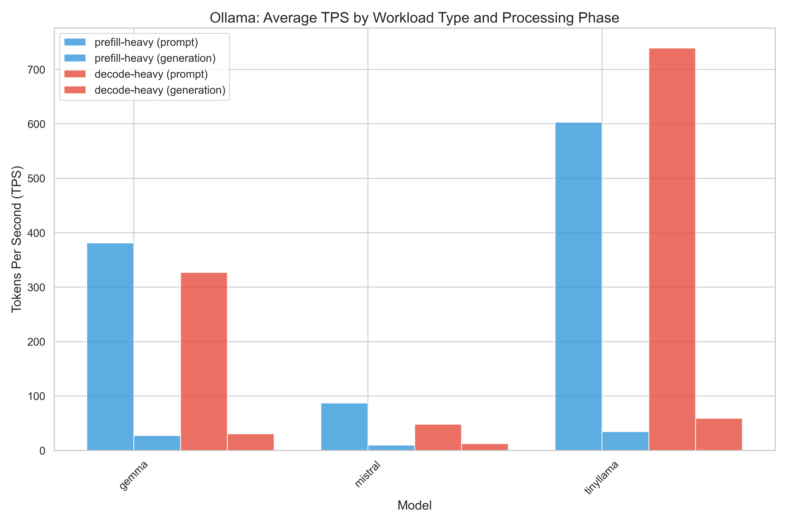
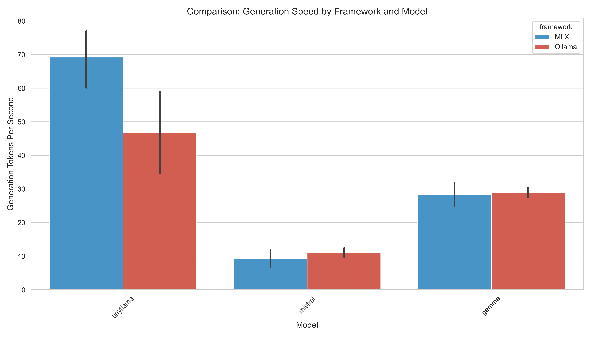
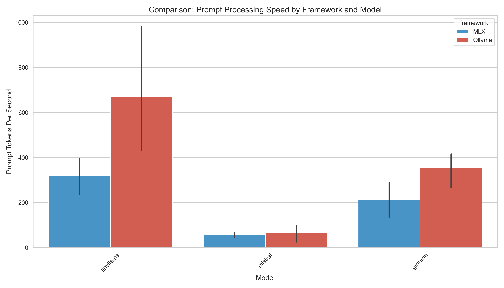
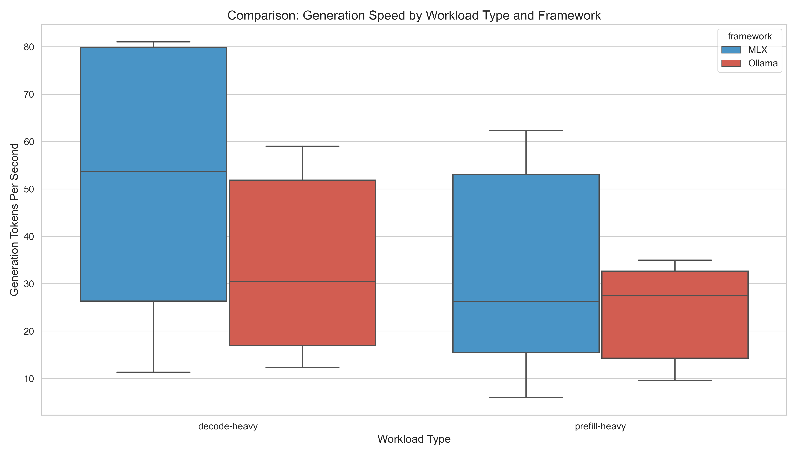

# On-Device LM Benchmarking: MLX vs Ollama

This repository contains benchmark results comparing the performance of language models (LLMs) running locally on Apple Silicon using two frameworks:
- **MLX**: Apple's machine learning framework optimized for Apple Silicon
- **Ollama**: A lightweight framework for running LLMs locally

## Understanding Prefill vs Decode Workloads

Language model inference consists of two distinct phases:

1. **Prefill (Input Processing)**: The initial processing of the prompt/input tokens
2. **Decode (Generation)**: The sequential generation of each output token

These phases have fundamentally different performance characteristics:

- **Prefill-heavy tasks** involve processing large inputs to generate relatively smaller outputs (e.g., summarization)
- **Decode-heavy tasks** involve processing small inputs to generate extensive outputs (e.g., creative writing)

## Performance Analysis

### Prompt TPS vs Generation TPS

*MLX: Relationship between prompt processing and generation speeds*

*Ollama: Relationship between prompt processing and generation speeds*

**Key Observations:**
- Both frameworks consistently process prompt tokens faster than they generate new tokens
- For MLX, TinyLlama shows the widest gap between prompt and generation speeds
- Ollama demonstrates remarkably higher prompt processing speeds, especially for TinyLlama
- Mistral shows the smallest difference between prompt and generation speeds in both frameworks

The graph shows that prefill-heavy workloads achieve significantly higher prompt TPS by amortizing fixed overheads—like weight loading and I/O—across many input tokens. This efficient batching pushes the blue dots far to the right. While their generation TPS is often lower than that of decode-heavy workloads, the prompt phase dominates their performance profile, highlighting how processing many tokens in one pass leads to much greater efficiency during input handling. Conversely, the red dots are pushed to the left because decode-heavy tasks are not optimized for prompt TPS, and the I/O speed of decoding will be the same across both groups. (Change in prompt TPS, static decode TPS = different proportions)

### Model Performance Comparison

*MLX: Performance across different models and workload types*

*Ollama: Performance across different models and workload types*

**Key Observations:**
- Prefill-heavy workloads show similar performance patterns across both frameworks
- Decode-heavy workloads highlight MLX's optimization for generation tasks
- Ollama's performance is more consistent across workload types
- Smaller models (TinyLlama) show the greatest performance difference between frameworks

### Framework Comparison

*Generation speed comparison between MLX and Ollama across models*

*Prompt processing speed comparison between MLX and Ollama across models*

*Performance comparison by workload type between frameworks*

**Key Thoughts:**

1. **Generation Performance**:
   - MLX has better generation performance for TinyLlama (~69 vs ~47 tokens/sec)
   - Gemma and Mistral show similar generation performance across frameworks
   - MLX appears optimized for generation tasks, especially with smaller models

2. **Prompt Processing**:
   - Ollama consistently outperforms MLX in prompt processing speed
   - The difference is most dramatic with TinyLlama, where Ollama processes prompts ~2x faster
   - Mistral shows similar prompt processing performance in both frameworks

3. **Workload Type Performance**:
   - MLX shows higher median performance for decode-heavy tasks
   - Both frameworks perform similarly on prefill-heavy tasks
   - MLX exhibits greater performance variability across both workload types
  
**Some Nuances:**

1. **MLX-LM Package**:
   - We used the MLX-LM high-level package rather than coding MLX from scratch
   - This abstraction layer might introduce extra processing time and performance variability
   - Results may differ from optimized implementations built directly on the core MLX framework

2. **Sample Size**:
   - Benchmarks were conducted with only 2 samples per model and dataset combination
   - Limited sample size may not fully represent real-world performance characteristics

## Conclusion

MLX shows advantages in generation speed, particularly with smaller models, while Ollama offers more consistent performance and superior prompt processing.
